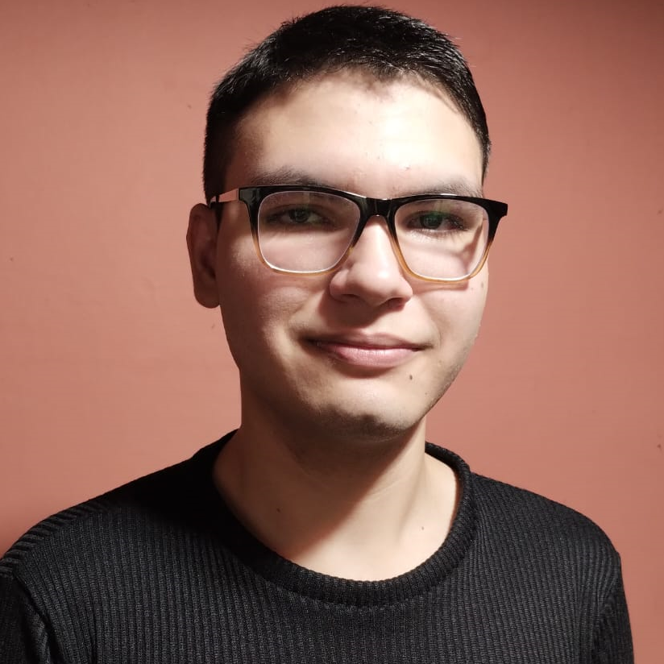

<h1 align="center">¡Hola 👋! Soy Santiago Morillo 👨🏻‍💻</h1>

<h2 align="center">Desarrollador Web Full Stack && Futuro Técnico en Informática </h2>

Me apasiona el desarrollo de sistemas informáticos y la implementación de aplicaciones eficientes para optimizar tareas. Disfruto aprender y mantenerme al día con las tendencias crecientes en el mercado.

<h2><b>🛠️ Tecnologías y Herramientas</b></h2>
<ul>
<li>Lenguajes de Programación: JavaScript</li>
<li>Frameworks y Librerías: React, Node.js, Express</li>
<li>Bases de Datos: MongoDB, MySQL</li>
<li>Control de Versiones: Git, GitHub</li>
<li>Otras Herramientas: Visual Studio Code, Postman, Docker</li>
</ul>

<h2><b>📚 Educación</b></h2>
<ul>
<li>Escuela de Educación Secundaria Técnica N°6</li>
<li>UNLaM - UNSaM – Olimpiada Informática Argentina</li>
<li>HackerRank – Problem Solving Basic and Intermediate</li>
<li>Platzi - English Intermediate Course</li>
<li>Coderhouse - Platzi – Stack MERN</li>
</ul>

<h2><b>🎖️Reconocimientos</b></h2>

<ul>
<li>Noveno puesto en la Olimpiada Informática Argentina a nivel nacional (2024)</li>
<li>Tercer puesto en la Olimpiada Informática Argentina a nivel regional (2024)</li>
</ul>

<h2><b>⭐Proyectos</b></h2>

<ul>
<li><a href="https://tecnica6lam.vercel.app/">Proyecto Institucional de la Técnica 6 (2023)</a></li>
<li><a href="https://halloween-ingles.vercel.app/">Proyecto de Halloween para el 31 de Octubre (2024)</a></li>
</ul>