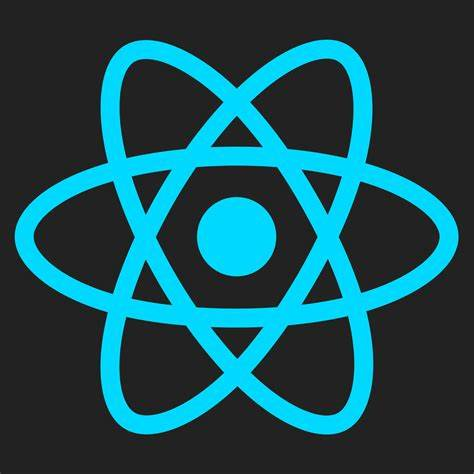

<h1 align="center">¡Hola 👋! Soy Santiago Morillo 👨🏻‍💻</h1>

<h2 align="center">Desarrollador Web Full Stack && Futuro Técnico en Informática </h2>

  
  

Me apasiona el desarrollo de sistemas informáticos y la implementación de aplicaciones eficientes para optimizar tareas. Disfruto aprender y mantenerme al día con las tendencias crecientes en el mercado.

---

### 🌱 Actualmente...
- 🔭 Trabajando en: Orientatec
- 📚 Aprendiendo: Azure y AWS
- 💡 Buscando: Mi primera experiencia en IT

---

### 🛠️ Tecnologías y Herramientas

**Frontend:**  

**Backend & Bases de Datos:**  

**Herramientas:**  

---

### ⭐ Proyectos Destacados

* **[OrientaTec](https://orientatec.com.ar/)**
  * **Descripción:** Sitio para encontrar Escuelas Técnicas y sus modalidades en La Matanza, Morón y Hurlingham..
  * **Tecnologías:** `HTML`, `CSS`, `JavaScript`, `PHP`, etc.

* **[Proyecto de Halloween (2024)](https://tecnica6lam.vercel.app/)**
  * **Descripción:** Aplicación creada utilizando Firebase para poder manejar las preinscripciones de los alumnos hacia la Técnica 6.
  * **Tecnologías:** `React`, `CSS`, etc.

---

### 🎖️ Reconocimientos & Educación

**🏆 Logros Destacados:**
- **9° Puesto Nacional** - Olimpiada Informática Argentina (2024)
- **8° Puesto Nacional** - Olimpiada Informática Argentina (2025)
- **3° Puesto Regional** - Olimpiada Informática Argentina (2024)
- **2° Puesto Regional** - Olimpiada Informática Argentina (2025)

**📚 Formación Académica y Cursos:**
- **Educación Secundaria:** Escuela de Educación Secundaria Técnica N°6 *Técnico en Informática Personal y Profesional*
- **Estudios Universitarios:** Universidad Nacional de La Matanza *Ingeniería en Informática*
- **Olimpiadas:** UNLaM - UNSaM – Olimpiada Informática Argentina
- **Bootcamps/Plataformas:** 
  - Coderhouse & Platzi (Stack MERN)
  - HackerRank (Problem Solving Basic and Intermediate)
  - Platzi (English Intermediate Course)

---

### 📊 Estadísticas de GitHub

  
  

